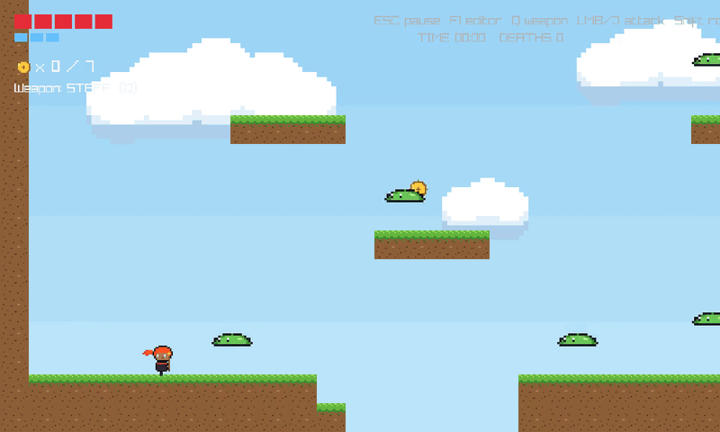
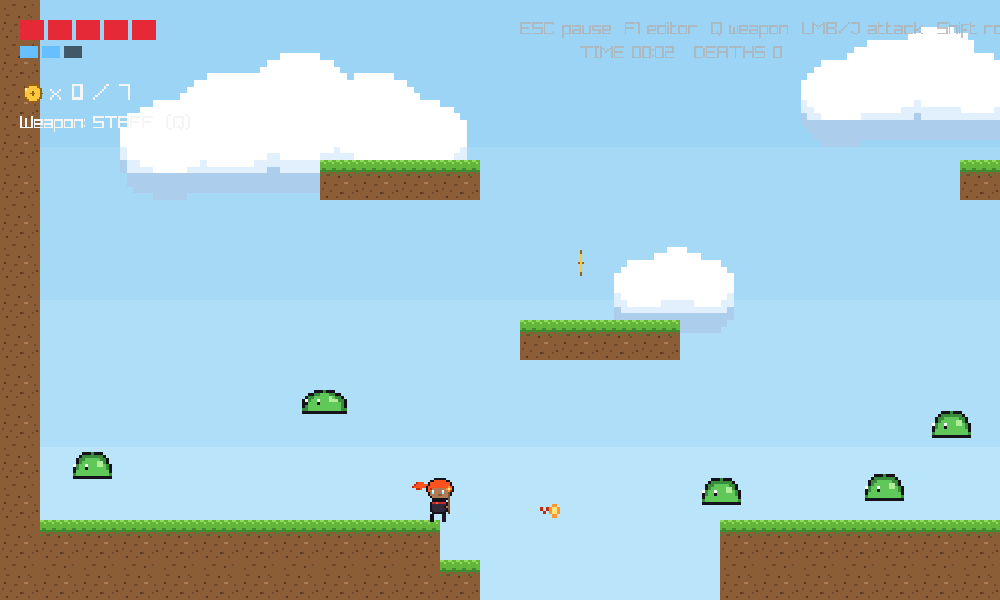
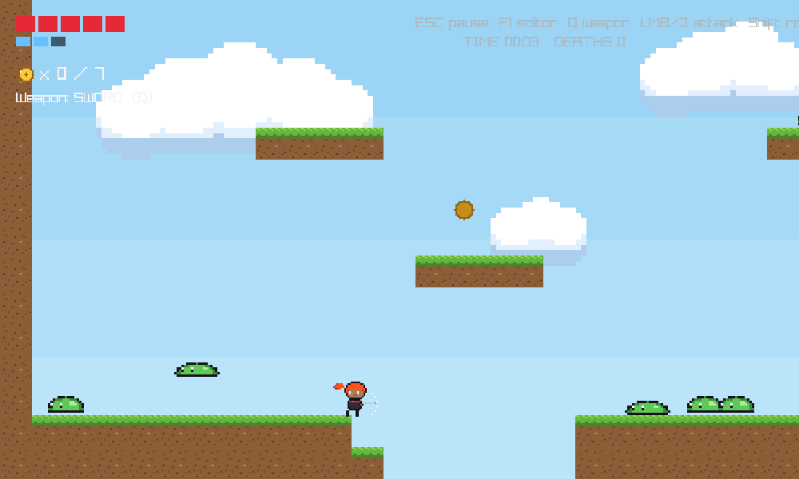
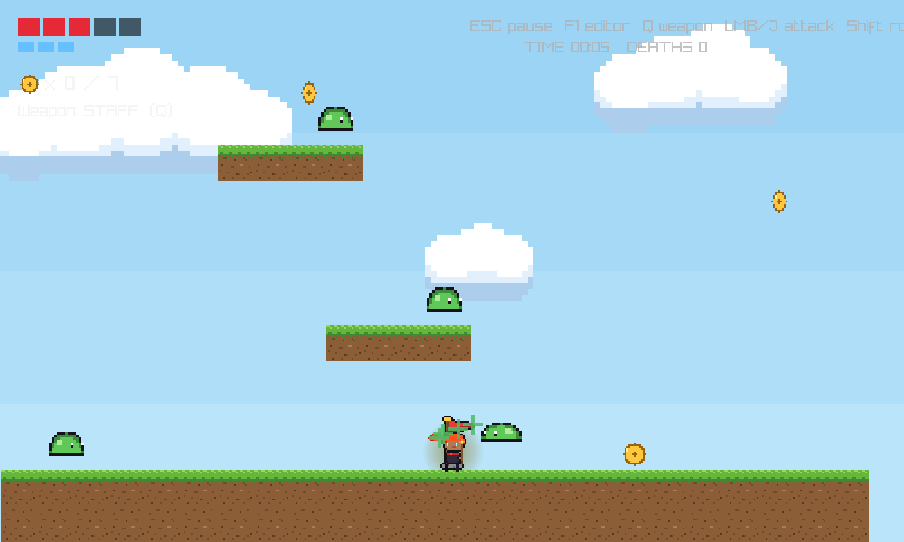
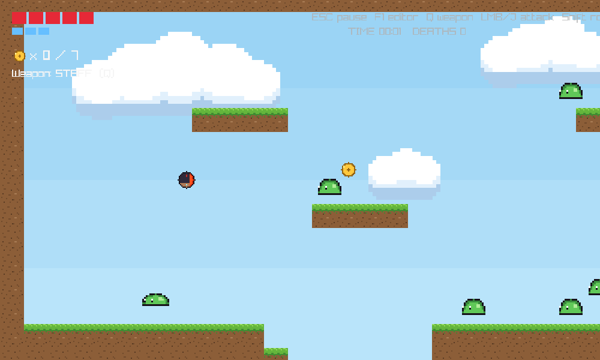
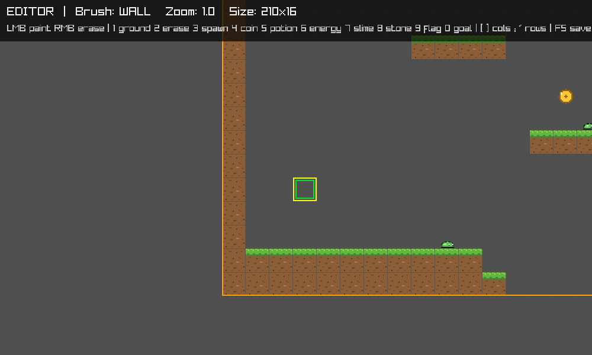
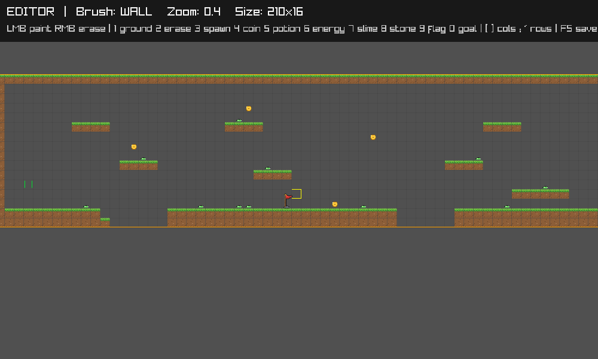
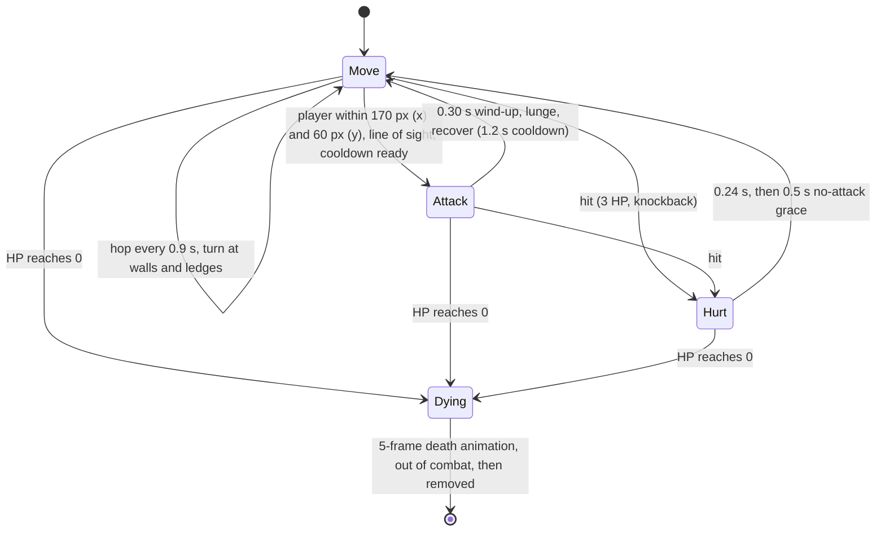

# Emberstaff

A 2D action-platformer written from scratch in **C++20** on top of [raylib](https://www.raylib.com/).
Everything above the windowing/drawing layer is hand-written: the movement model, tile collision,
enemy AI, combat, entity lifetime, the level format and an in-game level editor — no physics engine,
no scene graph, no ECS framework.

[](https://github.com/Yanbo314/emberstaff/actions/workflows/build.yml)


[](LICENSE)

<p align="center">
  
</p>

## Engineering highlights

- **Tunable platformer feel** — acceleration/friction ground and air models, coyote time, jump buffering,
  variable jump height, asymmetric gravity, a double jump, a dodge roll with i-frames, and an air-attack hover.
  Nearly every value is a named `constexpr` in one block, so the feel can be re-tuned without touching logic.
- **Axis-separated AABB tile collision** — the body is moved and resolved on X, then on Y, against the tile grid.
  Ground contact and the *landed-this-frame* edge fall out of the Y pass, which drives the landing dip.
- **Enemy AI as an explicit state machine** — `Move / Attack / Hurt / Dying` with ledge and wall detection,
  a 2-axis aggro box gated by a tile-grid line-of-sight check, a telegraphed wind-up before the lunge,
  and a death animation that keeps the body simulated but out of combat until cleanup.
- **Deterministic frame pipeline** — state transitions → player → collision → enemies → projectiles/FX →
  interactions → mark-and-sweep cleanup → camera → render. Entities are plain structs in `std::vector`s,
  removed with the erase-remove idiom after the frame's interactions have run.
- **Data-driven levels** — a level is an ASCII grid; entities are spawned by scanning it, so the map is a
  pure template. The built-in editor paints tiles, resizes the map, and hot-reloads it into a running game.
- **Resolution-independent presentation** — the game renders to a fixed 1000×600 target that is
  letterboxed into any window size, with mouse coordinates remapped to match; seamless three-image
  parallax sky; sprite foot-padding measured at load time so every sheet sits on the ground correctly.
- **Robust content loading** — the content root is discovered at start-up (working directory,
  executable directory, or parents), every asset degrades to a primitive-shape fallback if missing,
  and audio failures are non-fatal.

## Screenshots

| | |
|:---:|:---:|
|  |  |
| Staff: ranged fireball, costs mana (top-left bar) | Sword: short-range melee, 2× damage |
|  |  |
| Checkpoint flag activated (visual FX only), slime lunging at the player | Double jump plays a roll |
|  |  |
| In-game level editor (F1) | Same level zoomed out to 0.4× |

## Controls

| Action | Keyboard / Mouse | Gamepad |
|---|---|---|
| Move | `A` `D` or `←` `→` | Left stick |
| Jump / double jump | `Space` (hold for a higher jump) | A |
| Attack | `J` or left mouse button | X |
| Switch weapon (staff ↔ sword) | `Q` | Y |
| Roll (dodge, i-frames) | `Left Shift` or `K` | B |
| Pause | `Esc` | — |
| Level editor | `F1` | — |
| Borderless fullscreen | `Alt` + `Enter` | — |

## Building

The only dependency is raylib 6.0. C++20 is required.

### Windows — Visual Studio 2022

1. Download the `raylib-6.0_win64_msvc16` release from the
   [raylib releases page](https://github.com/raysan5/raylib/releases) and unzip it.
2. Point the project at it, either by setting an environment variable
   `RAYLIB_DIR=<path containing include\ and lib\>` or by unzipping it so that `external\raylib\include`
   and `external\raylib\lib` exist (that folder is git-ignored).
3. Open `Emberstaff.sln`, pick **x64**, build and run. The debugger's working directory is the
   repository root, so `assets/` and `levels/` are found directly. Release builds are GUI
   applications (no console window); Debug keeps the console for raylib's log output.

### Any platform — CMake

```sh
cmake -S . -B build -DCMAKE_BUILD_TYPE=Release   # fetches and builds raylib 6.0 if it is not installed
cmake --build build --parallel
./build/emberstaff                                # or build\Release\emberstaff.exe with Visual Studio generators
```

On Linux, raylib needs the X11/OpenGL/ALSA development packages first, e.g. on Debian/Ubuntu:
`sudo apt install libx11-dev libxrandr-dev libxi-dev libxcursor-dev libxinerama-dev libgl1-mesa-dev libasound2-dev`.

`cmake --build build --target dist` assembles a self-contained `build/dist/` folder (executable +
`assets/` + `levels/`) that can be zipped and shared. Developed with Visual Studio 2022 on Windows; also
builds warning-free with GCC 13 on Ubuntu 24.04 via CMake. The CI workflow builds Windows, Linux and
macOS on every push to `main` and on pull requests.

## Architecture

The whole game is deliberately a single translation unit (`src/main.cpp`, ~1.8k lines), organised
top-down: tunables → asset loading → data types → level → simulation → rendering → editor → `main`.
Update code never draws and draw code never mutates game state.

### Frame pipeline

```mermaid
flowchart LR
    S[State transitions<br/>Esc pause · F1 editor] --> P[UpdatePlayer<br/>input · timers · jump logic · gravity]
    P --> C[MoveAndCollide<br/>X pass, then Y pass]
    C --> A[UpdatePlayerAnim<br/>derive AnimState]
    A --> D[Fall-out / death<br/>respawn at checkpoint]
    D --> E[UpdatePickups · UpdateEnemy ×N<br/>UpdateFireballs · UpdateFxs]
    E --> I[HandleInteractions<br/>pickups · hitboxes · contact damage]
    I --> T[UpdateTileTriggers<br/>checkpoint · goal → WIN]
    T --> K[CleanupEntities<br/>erase-remove]
    K --> V[UpdateCamera]
    V --> R[Render<br/>parallax → tiles → entities → HUD]
```



Simulation runs on the frame delta (`GetFrameTime()`, v-sync plus a 60 FPS target) and every timer in
the game is measured in seconds; the one per-frame quantity is the air-attack hover damping.

### Player movement model

Horizontal speed moves toward the target speed at a fixed rate (`MoveToward`), with separate ground and
air rates for accelerating and for stopping. Vertical motion uses gravity with a fall multiplier so
jumps feel snappy rather than floaty.

| Feel parameter | Value | Where it lives |
|---|---|---|
| Max run speed | 300 px/s (×1.5 with an energy bottle) | `MOVE_SPEED`, `BOOST_MULT` |
| Ground accel / friction | 2600 / 3200 px/s² | `ACCELERATION`, `FRICTION` |
| Air accel / friction | 1400 / 700 px/s² | `AIR_ACCEL`, `AIR_FRICTION` |
| Gravity, falling multiplier, terminal speed | 1000 px/s², ×1.7, 1500 px/s | `GRAVITY`, `FALL_MULT`, `MAX_FALL` |
| Jump impulse, early-release cut | 600 px/s, ×0.45 | `JUMP_SPEED`, `LOW_JUMP_CUT` |
| Coyote time / jump buffer | 0.10 s / 0.10 s | `COYOTE_TIME`, `JUMP_BUFFER` |
| Double-jump lockout | 0.10 s | `AIR_JUMP_LOCKOUT` |
| Roll: speed, duration, cooldown after it ends | ×1.4, 0.36 s, 0.55 s | `ROLL_SPEED_MULT`, `ROLL_DURATION`, `ROLL_COOLDOWN` |
| Air-attack hover | first 0.20 s, fall speed ×0.15 per frame | `ATTACK_HOVER_TIME`, `ATTACK_HOVER_DAMP` |

Details worth noting: the jump cut only applies to ground jumps (`jumpCutable`), so the double jump has a
fixed height; the jump buffer and coyote window are consumed together so a single press can never
produce two jumps; the roll is ground-only, locks facing and horizontal velocity for its duration and
grants dodge i-frames against contact damage; the *double jump* reuses the roll timer and animation —
it locks facing and horizontal speed at run speed for 0.36 s and cancels an in-progress attack — but
without the i-frames.

### Collision

`MoveAndCollideBody` integrates position one axis at a time. After each axis the body's AABB is tested
against every solid tile it overlaps and pushed out on that axis only, zeroing that velocity component.
The Y pass sets `onGround` and reports a *landed* edge (air → ground) that starts the landing dip.
Player, slimes and the dying-slime bodies all share this routine; tiles outside the map are solid on the
sides and open above/below, which is what lets things fall out of the world and respawn.

### Combat

- **Staff** fires a projectile on the second of its three attack frames (`fireballShot` guarantees one per swing):
  520 px/s, 1.2 s lifetime, 1 damage, removed on contact with a solid tile or an enemy. Costs 1 mana;
  3 mana regenerate one point every 2.5 s, with the partial refill drawn in the HUD.
- **Sword** activates a 46 px hitbox in front of the player on the second of its three frames for 2 damage;
  `attackHit` limits a swing to a single frame of damage, so no slime is hit twice by one swing while
  several overlapping slimes can all be hit.
- **Taking damage**: contact with a slime that is not hurt/dying costs 1 HP, locks controls for the
  2-frame hurt animation, applies directional knockback, and grants 1.0 s of invincibility rendered as
  a blink. Falling out of the map costs 1 HP and returns the player to the last checkpoint. At 0 HP the
  run continues from the checkpoint with full HP, the death counter increments and enemies respawn
  while collected coins stay collected.

### Enemy AI — slime



Ledge detection probes the tile ahead at body height (wall) and at foot height (drop) before each hop.
Line of sight samples the segment between centres every half tile against solid tiles, so slimes do not
aggro through floors. The wind-up gives the player a readable tell before the lunge.

### Entities and lifetime

Pickups, enemies, fireballs and FX are plain structs, each in its own `std::vector`. Interactions only
*mark* (`remove = true`, or `life <= 0`); `CleanupEntities` sweeps all four vectors once per frame with
`std::remove_if`, so nothing is erased while being iterated. Two deliberate exceptions to "dead means
removed": a dying slime stays in the world until its animation ends (still under gravity and tile
collision, but no longer able to hit or be hit), and a collected health potion goes *dormant* and
respawns in place after 10 s.

### Levels and the editor

A level is a text grid, one character per 40 px tile (`levels/level.txt`, with a `constexpr` default level
compiled in as a fallback):

| Char | Tile | Char | Tile |
|:---:|---|:---:|---|
| `#` | Ground (grass top, dirt when covered) | `C` | Coin (one-shot, counted toward the total) |
| `R` | Stone block | `H` | Health potion (respawns after 10 s) |
| `.` | Empty | `B` | Energy bottle (5 s speed boost + full mana) |
| `S` | Player spawn | `E` | Slime spawn |
| `F` | Checkpoint flag | `G` | Goal door |

Entities are spawned by scanning the grid when a game starts, so the map itself never changes during
play. Press `F1` to open the editor on the current level:

| Editor | Keys |
|---|---|
| Paint / erase | Left / right mouse button |
| Brush | `1` ground `2` erase `3` spawn `4` coin `5` potion `6` energy `7` slime `8` stone `9` flag `0` goal |
| Pan / zoom | `WASD` or arrows / mouse wheel (0.2× – 3×) |
| Resize | `[` `]` remove/add column, `;` `'` remove/add row |
| Save / reload | `F5` writes `levels/level.txt`, `F9` reloads it (or the built-in level if the file is missing) |
| Back to the game | `F1` (re-syncs entities if the map changed), `Esc` to the menu |

### Rendering

The scene is drawn into a 1000×600 render texture and blitted with uniform scaling and letterboxing,
so the game looks identical in a resized window or borderless fullscreen; `SetMouseOffset/Scale` keep
UI hit-testing correct. Tiles are culled to the visible camera rectangle. Sprite sheets are single-row
strips; frames are selected by index and mirrored with a negative source width. At load time each sheet
is scanned for its lowest opaque row so the sprite's feet line up with its collision box regardless of
canvas padding. Visual feedback that does not need extra frames is done with tint and overlays: the
invincibility blink skips draws, the speed boost flickers the tint, heal and coin effects are small
overlay sprites with their own lifetimes.

## Project layout

```
.
├── src/main.cpp              game source (single translation unit)
├── assets/
│   ├── background/           sky layers and tile textures
│   ├── character/            player, slime, projectile, pickup and FX sprite sheets
│   └── sfx/                  sound effects and music (WAV)
├── levels/level.txt          the shipped level (editable in-game)
├── docs/                     README media
├── CMakeLists.txt            portable build (fetches raylib if needed)
├── Emberstaff.sln / .vcxproj Visual Studio 2022 project
└── .github/workflows/        CI: Windows + Linux builds
```

## Roadmap

- Fixed-timestep simulation with render interpolation (currently variable `dt`, which is safe at 60 Hz
  but can tunnel through one-tile walls on a long frame hitch).
- Split `main.cpp` into modules (`level`, `player`, `enemy`, `render`, `editor`) with an
  enum-indexed asset table.
- Spawner tiles with population caps, a second enemy archetype, and procedurally generated terrain that
  respects the jump envelope derived from the movement constants.
- Unit tests for the pure functions (collision resolution, level parsing, line of sight).

## Credits

Code, pixel art and sound design by Yanbo Liu. Built with [raylib](https://www.raylib.com/) by Ramon Santamaria.
Released under the [MIT License](LICENSE).
